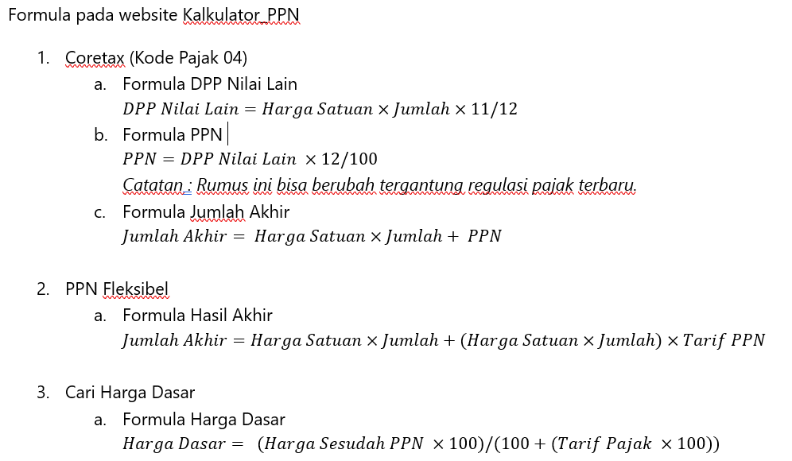
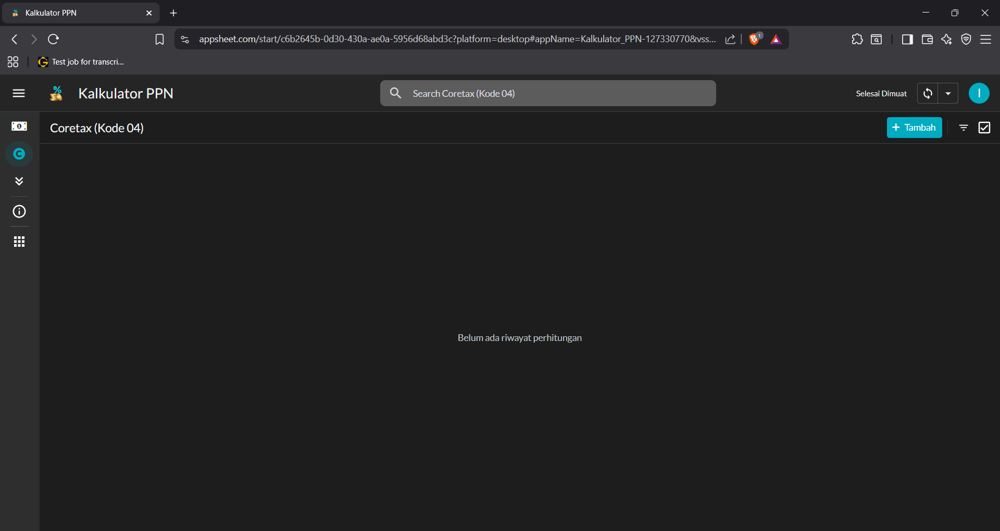
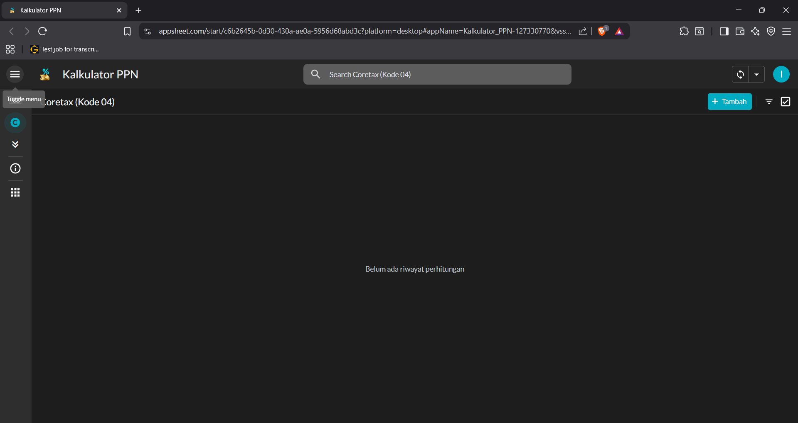
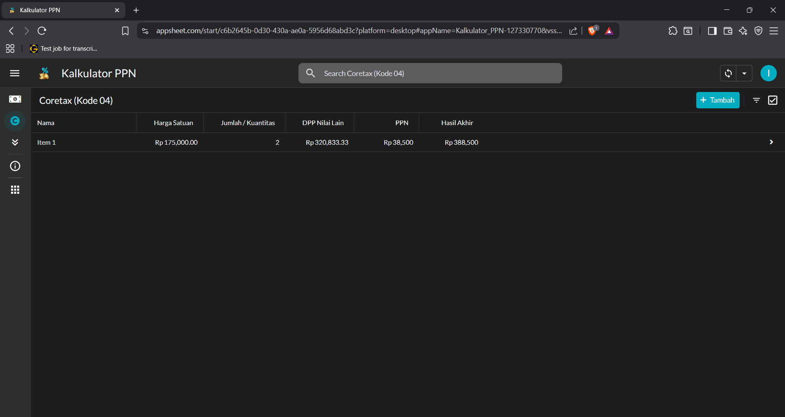
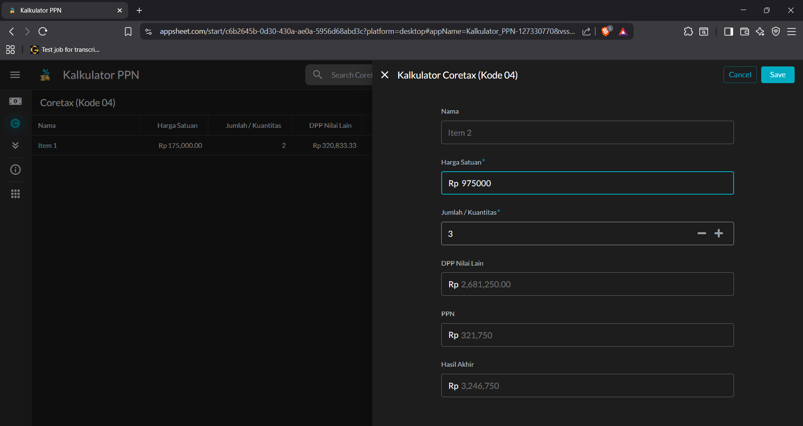
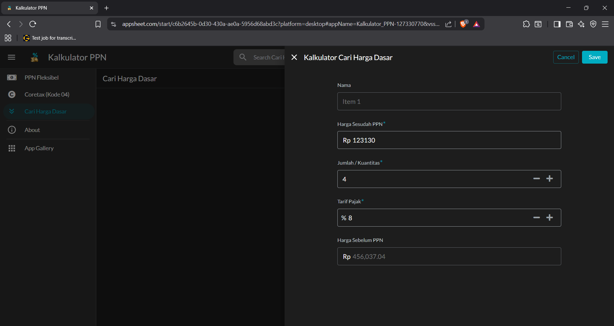
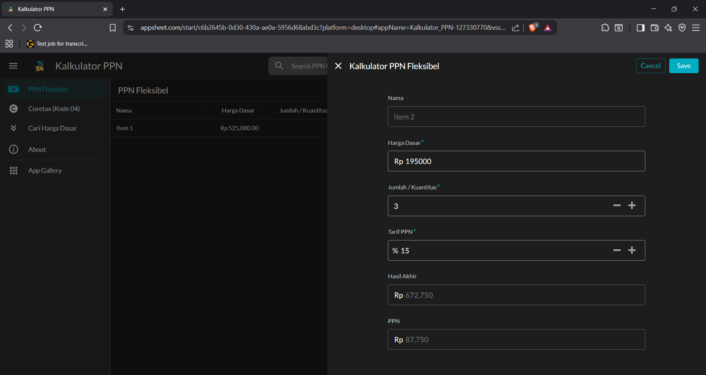
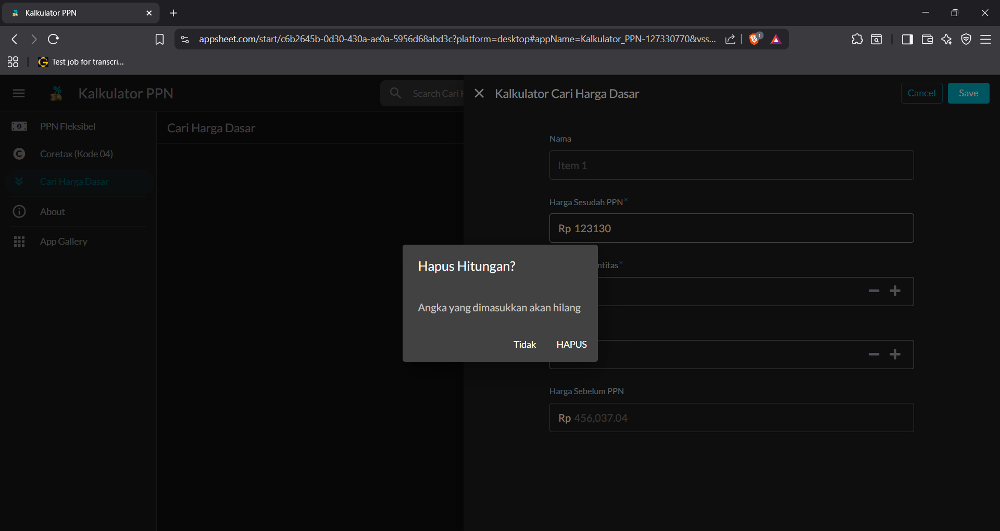
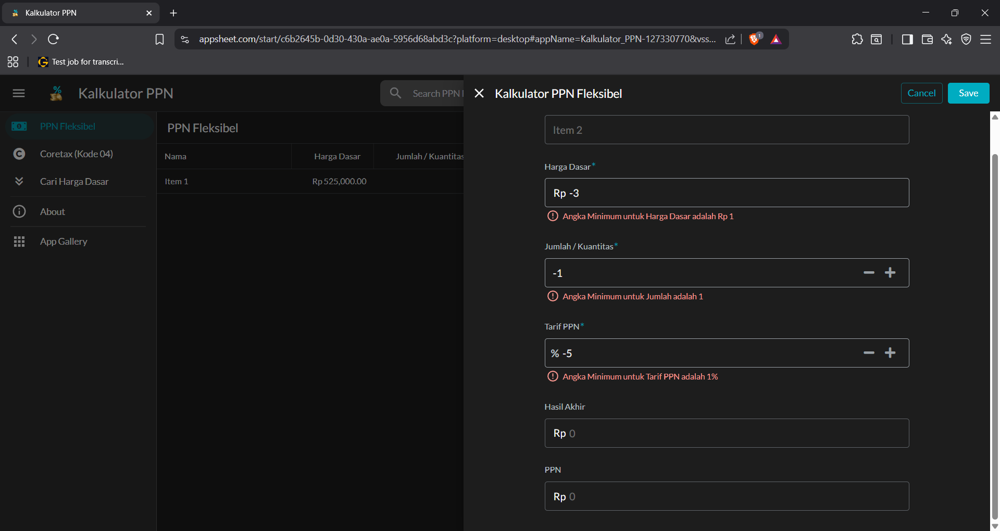

# Kalkulator PPN 12% / VAT 12% Calculator 🇮🇩 🇬🇧

---

### 🇮🇩 Deskripsi Singkat
Aplikasi kalkulator PPN sederhana yang dibuat dengan `low-code` untuk membantu pengguna menghitung Pajak Pertambahan Nilai (PPN) sebesar 12%. Aplikasi ini menyimpan riwayat perhitungan secara personal dan aman, mengatasi tantangan umum dalam pengembangan `low-code`.

### 🇬🇧 Brief Description
A simple VAT calculator app built with `low-code` to help users compute 12% Value Added Tax (VAT). This application securely stores personal calculation history, addressing common challenges in `low-code` development.

---

### 🎯 Tujuan Proyek / Project Goals

* 🇮🇩 Membantu pengguna menghitung PPN secara mudah dan cepat, cocok untuk kebutuhan individu dan UMKM dalam mengisi formulir faktur pajak.
* 🇬🇧 Helping users quickly and easily calculate VAT, suitable for personal and small business use in filling out tax invoice forms.

---

### 🛠️ Tools yang Digunakan / Tools Used

* **Figma** (mockup & prototype)
* **AppSheet** (platform pengembangan `low-code`)
* **Google Sheets** (sebagai `database` utama dengan tabel `coretax04db`, `ppnfleksibeldb`, dan `carihargadasardb`)
* **draw.io** (diagram tools)
* **Gemini** (AI assistant)

---

### 🚶 Alur Kerja Pengguna / User Flow

* **🇮🇩 Akses dan `Login`**: Pengguna membuka aplikasi dan diharuskan `login` untuk keamanan data.
  * 🇬🇧 **Access and Login**: The user opens the app and is required to log in for data security.
* **🇮🇩 Navigasi Utama**: Pengguna diarahkan ke kalkulator utama untuk membantu pengisian faktur pajak PPN di Coretax dengan Kode Pajak 04 (barang / jasa non-mewah). Mereka dapat mengakses kalkulator lain seperti PPN Fleksibel dan Cari Harga Dasar, serta halaman "About", melalui ikon `hamburger` di kiri atas.
  * 🇬🇧 **Main Navigation**: The user is directed to the main calculator to assist with VAT tax invoice filling in Coretax with Tax Code 04 (non-luxury goods/services). They can access other calculators like Flexible VAT and Find Base Price, as well as the "About" page, via the `hamburger` icon on the top left.
* **🇮🇩 Perhitungan dan Validasi `Real-time`**: Hasil perhitungan (output) langsung tertera pada `form` secara instan saat pengguna mengisi data. Aplikasi juga melakukan validasi untuk mencegah input tidak valid.
  * 🇬🇧 **Real-time Calculation and Validation**: The calculation result (output) appears instantly on the form as the user inputs data. The app also performs validation to prevent invalid input.
* **🇮🇩 Simpan/Batal**: Pengguna bisa menyimpan perhitungan ke `database` `spreadsheet` atau membatalkan entri. Jika `form` sudah terisi, opsi `Cancel` akan memunculkan verifikasi untuk mencegah kehilangan data.
  * 🇬🇧 **Save/Cancel**: The user can save calculations to the `spreadsheet` database or cancel the entry. If the form is filled, the `Cancel` option will trigger a verification to prevent data loss.

---

### ✨ Fitur Utama / Key Features

* **🔒 Keamanan Data Personal**: Setiap pengguna hanya dapat melihat data yang mereka buat sendiri melalui `Security Filters`.
  * 🇬🇧 **Personal Data Security**: Each user can only view their own data via `Security Filters`.
* **🖊️ Penomoran Item Otomatis**: Nama item dibuat secara otomatis untuk memudahkan pengisian formulir.
  * 🇬🇧 **Automatic Item Numbering**: Item names are automatically generated to simplify form-filling.
* **✅ Validasi Input**: Mencegah input nilai negatif atau nol pada kolom penting.
  * 🇬🇧 **Input Validation**: Prevents negative or zero values in key columns.
* **📈 Riwayat Perhitungan**: Menyimpan riwayat semua transaksi untuk ditinjau.
  * 🇬🇧 **Calculation History**: Stores a history of all transactions for review.
* **⚡ Perhitungan Instan**: Hasil perhitungan langsung terlihat pada form saat input diisi, bahkan tanpa perlu disimpan.
  * 🇬🇧 **Instant Calculation**: The calculation result is displayed instantly on the form as the input is filled, even without saving.

---

### 🧠 Pembelajaran & Tantangan / Challenges & Learnings

* **🇮🇩 Isu Autentikasi**: Aplikasi ini mewajibkan pengguna untuk `login` karena data disimpan secara personal dan perlu diakses secara aman. Ini berbeda dengan kalkulator web lainnya yang tidak menyimpan data.
  * 🇬🇧 **Authentication Issue**: This app requires users to log in because data is stored personally and needs secure access. This differs from other web calculators that do not store data.
* **🇮🇩 `Bug` Lokalisasi**: Mengatasi masalah format angka (misalnya, `xxx,xxx.xx` vs `xxx.xxx,xx`) di mana pengaturan `locale` tidak berfungsi secara konsisten.
  * 🇬🇧 **Localization Bug**: Overcoming number format issues (e.g., `xxx,xxx.xx` vs `xxx.xxx,xx`) where `locale` settings did not work consistently.
* **🇮🇩 Pemilihan Arsitektur**: Memilih struktur tiga tabel terpisah untuk menghindari kerumitan dan `bug` dalam satu tabel.
  * 🇬🇧 **Architecture Choice**: Choosing a separate three-table structure to avoid complexity and bugs from a single-table setup.

---

### 📦 Status Proyek / Project Status

✅ Aplikasi fungsional di AppSheet sudah selesai.

---

### 📸 Tangkapan Layar / Screenshots

* **Formula for each Calculators*:  

* **Tampilan Utama**:  

* **Tampilan Hamburger Side Menu**:  

* **Tampilan Riwayat Data**:  

* **Tampilan Kalkulator Coretax **:  

* **Tampilan Kalkulator Cari Harga Dasar**:  

* **Tampilan Kalkulator PPN Fleksibel**:  

'* **Tampilan Pop-Up Verifikasi Cancel**:  

* **Tampilan Validasi Input**:  

---

### 🧠 Rencana Lanjutan / Future Plans

* **🇮🇩 Ekspor Data**: Mengeksplorasi fungsionalitas ekspor data (.txt, .xml) sesuai dengan format standar sistem perpajakan.
  * 🇬🇧 **Data Export**: Exploring the functionality to export data (.txt, .xml) in accordance with the standard format of the tax system.
* **🇮🇩 `Dashboard` Visual**: Mengimplementasikan `dashboard` visual untuk analisis data.
  * 🇬🇧 **Visual Dashboard**: Implementing a visual dashboard for data analysis.
* **🇮🇩 Integrasi API**: Mempertimbangkan integrasi dengan sistem lain melalui API AppSheet.
  * 🇬🇧 **API Integration**: Considering integration with other systems via AppSheet's API.

---

### 📁 Lisensi / License
MIT License
